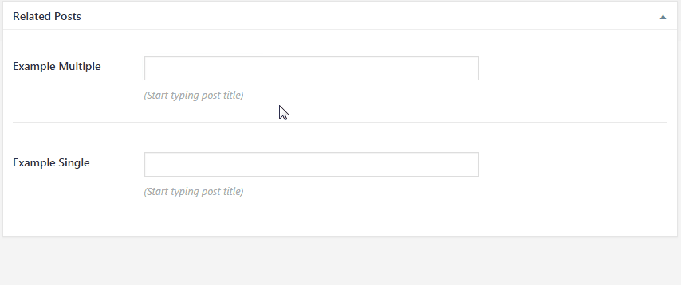

CMB2 Field Type: Ajax Search
==================

Custom fields for [CMB2](https://github.com/WebDevStudios/CMB2) to attach posts, users or terms to each others.



Once activated, this plugin adds three new field types `post_ajax_search`, `user_ajax_search` and `term_ajax_search`.

This plugin is an update of [CMB2 Field Type: Post Search Ajax](https://github.com/alexis-magina/cmb2-field-post-search-ajax) by [Magina](http://magina.fr/) with support to attach posts, users or terms.

## Installation

You can install this field type as you would a WordPress plugin:

- Download the plugin
- Place the plugin folder in your /wp-content/plugins/ directory
- Activate the plugin in the Plugin dashboard

## Parameters

Options : 
- multiple (bool, default = false) : Turn field into a multiple attached objects
- limit (int, default = -1 : single selection) : Limit the number of posts that can be selected (-1 for unlimited)
- sortable (bool, default = false) : Allow selected items to be sort (only if multiple = true)
- query_args (array) : Query arguments to pass on each request

Query args:
- query_args accepts same parameters as [WP_Query](https://codex.wordpress.org/Class_Reference/WP_Query) for `post_ajax_search`
- query_args accepts same parameters as [WP_User_Query](https://codex.wordpress.org/Class_Reference/WP_User_Query) for `user_ajax_search`
- query_args accepts same parameters as [WP_Term_Query](https://developer.wordpress.org/reference/classes/wp_term_query/) for `term_ajax_search`

## Examples

```php
add_action( 'cmb2_admin_init', 'cmb2_ajax_search_metabox' );
function cmb2_ajax_search_metabox() {

	$prefix = 'your_prefix_demo_';

	$cmb_demo = new_cmb2_box( array(
		'id'            => $prefix . 'metabox',
		'title'         => __( 'Attached posts Metabox', 'cmb2' ),
		'object_types'  => array( 'page', 'post' ), // Post type
	) );

	// Single post
	$cmb_demo->add_field( array(
		'name'          => __( 'Attached post', 'cmb2' ),
		'desc'          => __( 'Field description (optional)', 'cmb2' ),
		'id'            => $prefix . 'post',
		'type'          => 'post_ajax_search',
		'query_args'	=> array(
			'post_type'			=> array( 'post' ),
			'posts_per_page'	=> -1
		)
	) );

	// Multiple posts
	$cmb_demo->add_field( array(
		'name'          => __( 'Multiple posts', 'cmb2' ),
		'desc'          => __( 'Field description (optional)', 'cmb2' ),
		'id'            => $prefix . 'posts',
		'type'          => 'post_ajax_search',
		'multiple'      => true,
		'limit'      	=> 10,
		'query_args'	=> array(
			'post_type'			=> array( 'post', 'page' ),
			'post_status'		=> array( 'publish', 'pending' )
		)
	) );

	// Single user
	$cmb_demo->add_field( array(
		'name'          => __( 'Attached user', 'cmb2' ),
		'desc'          => __( 'Field description (optional)', 'cmb2' ),
		'id'            => $prefix . 'user',
		'type'          => 'user_ajax_search',
		'query_args'	=> array(
			'role'				=> array( 'Subscriber' ),
			'search_columns' 	=> array( 'user_login', 'user_email' )
		)
	) );

	// Multiple users
	$cmb_demo->add_field( array(
		'name'          => __( 'Multiple users', 'cmb2' ),
		'desc'          => __( 'Field description (optional)', 'cmb2' ),
		'id'            => $prefix . 'users',
		'type'          => 'user_ajax_search',
		'multiple'      => true,
		'limit'      	=> 5,
		'query_args'	=> array(
			'role__not_in'		=> array( 'Administrator', 'Editor' ),
		)
	) );

	// Single term
	$cmb_demo->add_field( array(
		'name'          => __( 'Attached term', 'cmb2' ),
		'desc'          => __( 'Field description (optional)', 'cmb2' ),
		'id'            => $prefix . 'term',
		'type'          => 'term_ajax_search',
		'query_args'	=> array(
			'taxonomy'			=> 'category',
			'childless'			=> true
		)
	) );

	// Multiple terms
	$cmb_demo->add_field( array(
		'name'          => __( 'Multiple terms', 'cmb2' ),
		'desc'          => __( 'Field description (optional)', 'cmb2' ),
		'id'            => $prefix . 'terms',
		'type'          => 'term_ajax_search',
		'multiple'      => true,
		'limit'      	=> -1,
		'query_args'	=> array(
			'taxonomy'			=> 'post_tag',
			'hide_empty'		=> false
		)
	) );

}
```

## Customize results output

You can use `cmb_{$field_id}_ajax_search_result_text` to customize the text returned from ajax searches and `cmb_{$field_id}_ajax_search_result_link` to customize the link, check next example:

```php
add_filter( 'cmb_your_prefix_demo_posts_ajax_search_result_text', 'cmb2_ajax_search_custom_field_text', 10, 3 );
function cmb2_ajax_search_custom_field_text( $text, $object_id, $object_type ) {
	$text = sprintf( '#%s - %s', $object_id, $text ); // #123 - Post title

	return $text;
}

add_filter( 'cmb_your_prefix_demo_posts_ajax_search_result_link', 'cmb2_ajax_search_custom_field_link', 10, 3 );
function cmb2_ajax_search_custom_field_link( $link, $object_id, $object_type ) {
	if( $object_id == 123 ) {
		$link = '#';
	}

	return $link;
}
```

## Retrieve the field value

If multiple == false will return the ID of attached object:
`get_post_meta( get_the_ID(), 'your_field_id', true );`

If multiple == true will return an array of IDs of attached object:
`get_post_meta( get_the_ID(), 'your_field_id', false );`

## Changelog

### 1.0.2
* Updated devbridgeAutocomplete lib

### 1.0.1
* Group fields support
* Widget area support
* Use of devbridgeAutocomplete() instead of autocomplete() to avoid errors

### 1.0.0
* Initial commit
